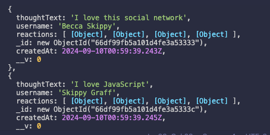
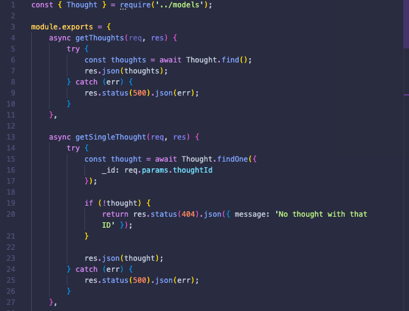

# <Your-Project-Title>

## Description

I wanted to build an application that uses APIs to populate information for a social networking app. This uses get/post/put/delete routes for the user to interact with the application. I learned more about and gained more experience with using API routes to build an interactive, back-end application.

## Table of Contents (Optional)

- [Installation](#installation)
- [Usage](#usage)
- [Credits](#credits)

## Installation

The user will run the seed with the command 'npm run seed' and then run the application with 'npm start'. They will then go to the Insomnia application to test the routes.

## Usage

When the seed is run, the user will see the following in image1.

    

See image2 for an example of the thoughtController routes.

    

## Credits

I used the class repo activities and mini-project for this unit for reference.

Link to Github repo: https://github.com/Lbgraff/social-network-API

Link to walkthrough video: https://drive.google.com/file/d/1L5siYUQkbP9hyikT5rywnGAjQmwPJLwx/view